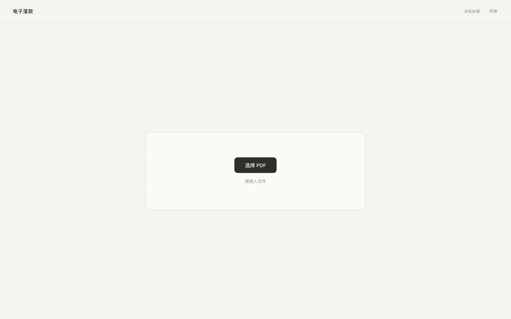
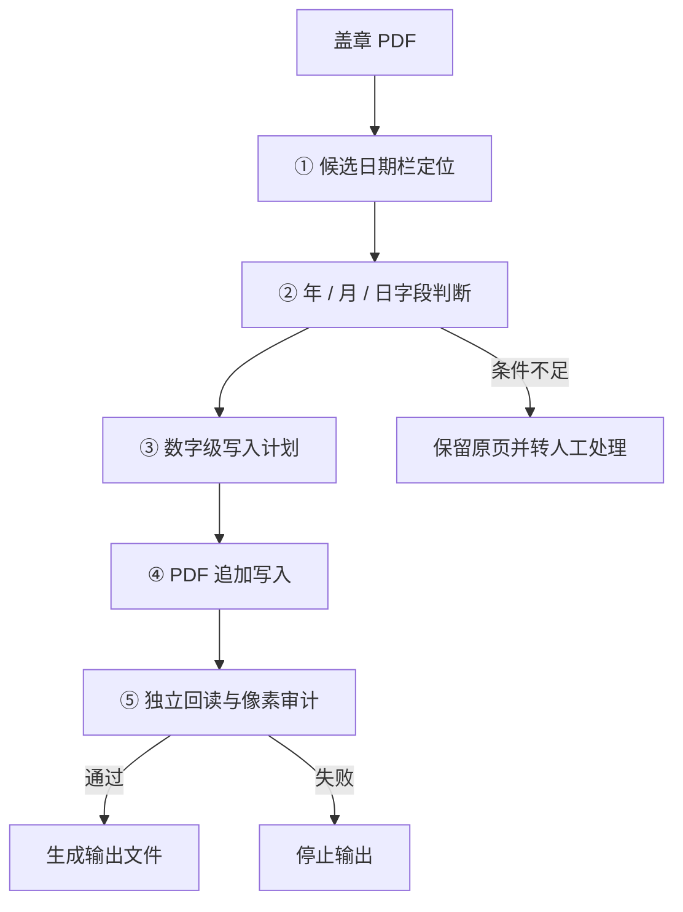

# Electronic Date Stamp

## PDF 落款日期自动化写入与审计

> A local PDF date-stamping tool focused on controlled placement, append-only writes and independent post-write auditing.

## 界面



> 截图使用虚构/合成数据，仅用于展示程序界面，不包含任何真实业务材料。

该工具用于在 PDF 扫描件中补写落款日期，并对写入范围进行独立校验。程序先定位候选日期栏，再分别判断年、月、日字段状态，生成数字级写入计划；仅在定位、字段和字体条件均满足时执行写入。存在不确定性时保留原页并转人工处理。

写入完成后，独立审计模块重新读取输出文件，并检查页面尺寸、旋转、原图像流以及允许区域之外的像素变化。任一校验失败时，该任务不生成最终输出。

## 核心能力

| 能力 | 说明 |
|---|---|
| **候选日期栏定位** | 定位可能的落款日期区域；定位结果仅作为后续判断输入，不直接授权写入 |
| **字段证据判断** | 分别判断年、月、日字段的已有内容、空白和不可判状态 |
| **数字级写入计划** | 写入计划细化到单个数字位置，并随目标日期或人工决策同步更新 |
| **追加式写入** | 自动写入仅限阿拉伯数字，不覆盖已有文字、数字、印章或其他页面内容 |
| **独立回读与像素审计** | 写入后重新读取输出文件，检查允许区域外是否发生非预期变化 |
| **人工兜底** | 无法稳定确认时保留原页，由人工决定是否处理及如何处理 |

## 处理流程



## 技术实现

| 层 | 实现 |
|---|---|
| 运行时 | Python 3.11+；启动脚本自动建立 `.venv` 并校验依赖版本 |
| 文档层 | PyMuPDF 直接读写 PDF，写入采用临时目录与原子替换 |
| 图像层 | OpenCV + NumPy 用于候选定位和像素级审计 |
| 角色分离 | 定位、规划、写入和审计分为独立模块，降低单一模块同时判断与自校验的风险 |
| 字体策略 | 不附带字体替代方案；字形条件不满足时拒绝自动写入 |
| 并发 | 页面可并行分析，单页失败不影响其他页面 |
| 服务层 | 本地 HTTP 服务，仅监听本机回环地址 |

## 测试与质量基线

```bash
pip install -r requirements-test.txt
python -m pytest -q
```

```text
47 passed
```

测试重点覆盖写入边界和审计约束，例如：

| 用例 | 约束 |
|---|---|
| `test_invisible_digit_cannot_be_force_overwritten` | 不可见数字不得被强制覆盖 |
| `test_wrong_existing_date_requires_explicit_preservation` | 已有日期与目标不一致时必须显式确认 |
| `test_non_date_change_fails_audit` | 非日期区域发生变化时审计失败 |
| `test_missing_field_fails_independent_audit` | 字段缺失必须被独立审计识别 |
| `test_writer_rejects_non_digit_by_default` | 写入器默认拒绝非数字内容 |
| `test_font_validator_rejects_bold_and_missing_glyph` | 字体条件不满足时拒绝写入 |
| `test_page_specific_date_override_only_changes_target_page` | 单页覆盖不得影响其他页面 |

## 快速开始

macOS：

```bash
./start_mac.command
```

Windows：

```text
start_windows.bat
```

Linux：

```bash
./start_linux.sh
```

手工运行：

```bash
python3 -m venv .venv
.venv/bin/pip install -r requirements.txt
.venv/bin/python server.py
```

## 项目结构

```text
server.py                 本地 HTTP 服务与 API
core/
  locator.py              候选日期栏定位
  evidence.py             字段证据提取
  planner.py              数字级写入计划
  writer.py               PDF 追加写入
  audit.py                独立回读与像素审计
  fonts.py                字体解析
  document.py             页面分析
  pdfsafe.py              结构安全检查与原子替换
  models.py               数据模型与版本
assets/                   日期定位相关模板
static/                   Web UI
tests/                    回归测试
tools/public_release_check.py   公开版脱敏检查
```

## 数据安全

本仓库为公开展示版本，仅包含通用代码、算法实现和回归测试。实际业务中的盖章 PDF、历史 QA 清单、输出文件和运行日志不进入版本库，正式部署版本与公开仓库分开维护。

## 许可

本仓库当前未附开源许可证。公开可见不代表自动授予复制、修改或再分发权限；如需复用，请先联系作者确认授权。
