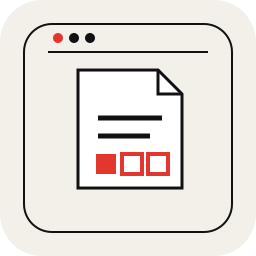
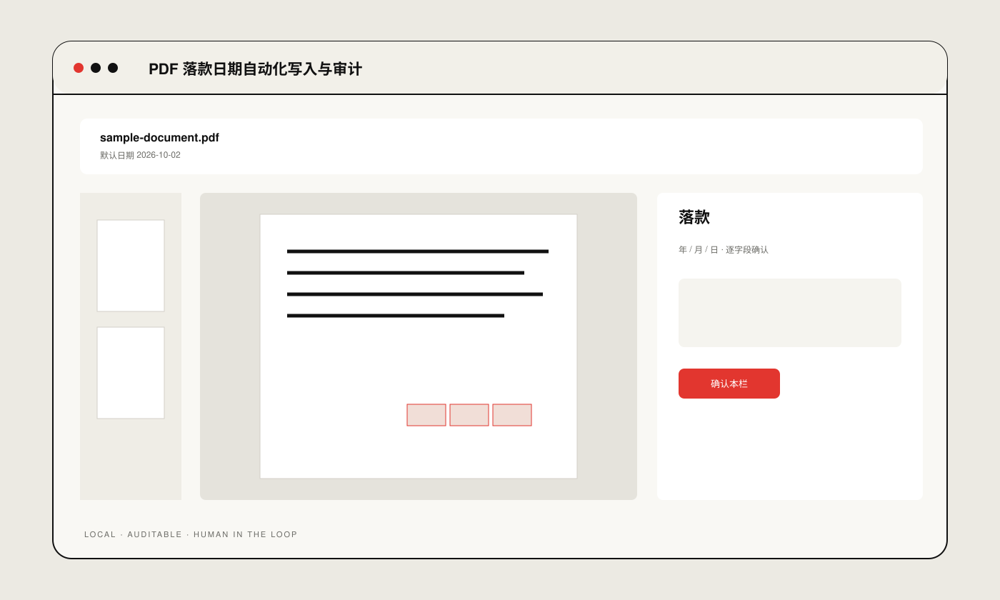

# Electronic Date Stamp

**PDF 落款日期自动化写入与审计**

A PDF date-stamping tool focused on safe placement, layout preservation and post-write auditing.

## Preview

Interface overview is a schematic preview based on the current UI structure, not a screenshot. No real business materials are shown.

**Engineering:** append-only writes · digit-level planning · independent pixel audit

## Validation

`47 passed` · independent post-write pixel audit

## Run locally

- macOS: `./start_mac.command`
- Windows: `start_windows.bat`
- Linux: `./start_linux.sh`

Public portfolio edition. No real client documents, production data or internal materials are included.

[Technical notes →](docs/technical-notes.md)
