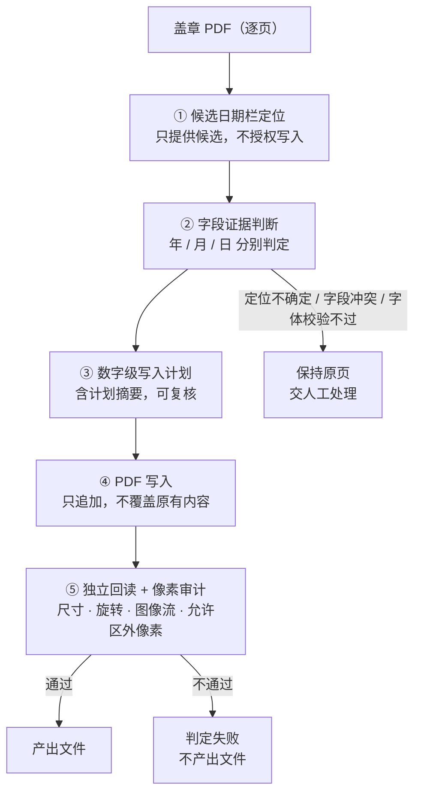

# Electronic Date Stamp

## PDF 落款日期自动化写入与审计

> An evidence-driven, append-only PDF stamping tool: it locates the date row on each page,
> weighs the field evidence, plans a digit-level write, and then independently re-reads the
> result and audits the page — refusing to write anything it cannot establish, and failing
> the run if a single pixel outside the permitted region changed.

一批盖章扫描件要补落款日期。人工做是打开 PDF、找到落款行、对齐字号、敲进年月日 —— 慢，而且
**这类文件是不允许改错的**：一旦覆盖了原有的文字、数字或印章，文件就不再是原件。

本工具把这件事做成一条**只追加、可审计**的链路：定位日期栏 → 判断字段证据 → 生成数字级写入计划 →
写入 PDF → **独立回读并做像素级审计**。

它的设计重心不在"能写进去"，而在**"什么情况下坚决不写"**：

- 自动写入**只允许阿拉伯数字**，且**不覆盖**任何已有文字、数字、印章或其他页面内容；
- 定位不确定、字段存在冲突、或字体校验不通过时，**保持原页并交人工处理**；
- 写入完成后，独立审计层比对页面尺寸、旋转角度、原图像流，以及**允许写入区域之外的像素变化** ——
  非日期区域出现任何改动即判定失败，整个任务不产出文件。


---

## 核心能力

| 能力 | 说明 |
|---|---|
| **候选日期栏定位** | 从页面中定位可能的落款日期位置；定位器**只提供候选**，不授权写入、不判定字段完整、不选择字体 |
| **字段证据驱动** | 年 / 月 / 日三个字段各自判断"已有内容 / 空白 / 不可判"，而不是整行二选一 |
| **数字级写入计划** | 计划细到单个数字格；计划摘要在日期或人工决策变化时同步变化，可复核 |
| **只追加写入** | 不覆盖原有文字、数字、印章与其他页面内容；写入内容限定为阿拉伯数字 |
| **独立回读与像素审计** | 写入后由独立审计层回读：页面尺寸、旋转、原图像流、允许区之外的像素变化，任一项不通过即失败 |
| **人工兜底与单页覆盖** | 无法稳定确认时保持原页交人工；单页日期覆盖**只改变目标数字**，不放宽覆盖保护、字体约束或审计规则 |

## 处理流程



## 技术实现

| 层 | 实现 |
|---|---|
| 运行时 | Python 3.11+；启动脚本自动建立 `.venv` 并**校验依赖版本与锁定值完全一致** |
| 文档层 | PyMuPDF 直接读写 PDF；写入走临时目录 + 原子替换 |
| 图像层 | OpenCV + NumPy 做候选定位与像素审计；`assets/` 内置 5 组字形模板（年 / 月 / 日）作为定位线索 |
| 角色分离 | **定位器 / 规划器 / 写入器 / 审计层四者独立**：定位器不授权写入，写入器默认拒绝非数字计划，审计层独立回读，不采信写入层的自述 |
| 字体策略 | **不做字体替换，不随程序附带字体**；字形不匹配即拒绝写入 |
| 并发 | 逐页并行分析，单页独立失败不影响其余页面 |
| 服务层 | 本地 HTTP 服务，仅监听本机回环地址；PDF 不上传网络 |

**为什么把审计做成独立一层**：如果写入层自己说"我写对了"，那只是自证。
审计层重新读产出文件、比对像素，才有资格说这次写入没有波及允许区域之外的地方。

## 测试与质量基线

```bash
pip install -r requirements-test.txt
python -m pytest -q
```

```
47 passed
```

测试集的写法偏向**安全不变量**而不是功能覆盖，例如：

| 用例 | 保护的不变量 |
|---|---|
| `test_invisible_digit_cannot_be_force_overwritten` | 不可见数字不得被强制覆盖 |
| `test_wrong_existing_date_requires_explicit_preservation` | 已有日期与目标不符时，必须显式确认才可保留 |
| `test_non_date_change_fails_audit` | 非日期区域发生变化 → 审计失败 |
| `test_missing_field_fails_independent_audit` | 字段缺失必须被独立审计捕获 |
| `test_writer_rejects_non_digit_by_default` | 写入器默认拒绝非数字内容 |
| `test_free_date_layout_never_creates_non_digits` | 自由布局也不会产出非数字 |
| `test_font_validator_rejects_bold_and_missing_glyph` | 字体变粗或字形缺失即拒绝 |
| `test_digit_grid_geometry_survives_red_seal` | 数字栅格几何在红色印章遮挡下仍成立 |
| `test_blurry_seal_projection_fallback_finds_ymd_without_templates` | 模糊印章下模板失效时的投影回退路径 |
| `test_page_specific_date_override_only_changes_target_page` | 单页覆盖不得波及其他页面 |
| `test_donor_group_never_moves_anchor_coordinates` | 参照组不得移动锚点坐标 |

## 快速开始

macOS 双击 `start_mac.command`，Windows 使用 `start_windows.bat`，Linux 使用 `start_linux.sh`。
首次运行会自动建立本机虚拟环境并安装依赖（PDF 不会上传至网络）。

手工运行：

```bash
python3 -m venv .venv && .venv/bin/pip install -r requirements.txt
.venv/bin/python server.py
```

## 项目结构

```
server.py                 本地 HTTP 服务与 API
core/
  locator.py              候选日期栏定位（只出候选）
  evidence.py             字段证据提取与判断
  planner.py              数字级写入计划
  writer.py               PDF 写入（只追加）
  audit.py                独立回读与像素审计
  fonts.py                字体解析（不替换、不附带字体）
  document.py             逐页并行分析
  pdfsafe.py              结构安全检查与原子替换
  models.py               数据模型与版本
assets/                   5 组字形模板（年 / 月 / 日）+ 日期标签模板
static/                   Web UI（原生 JS）
tests/                    回归测试（安全不变量为主）
架构说明.md                架构说明
tools/public_release_check.py   公开版脱敏自检
```

## 数据安全

本仓库为**公开展示版本**，仅包含通用代码、算法实现与回归测试。
实际业务中的盖章 PDF、历史 QA 清单、输出文件与运行日志均不包含在仓库中，
相关目录已由 `.gitignore` 排除。正式部署版本与本公开仓库分开维护。

## 许可

本仓库当前未附开源许可证。公开可见不等于自动获得复制、修改与再分发许可。
如需复用，请先联系作者确认授权。
